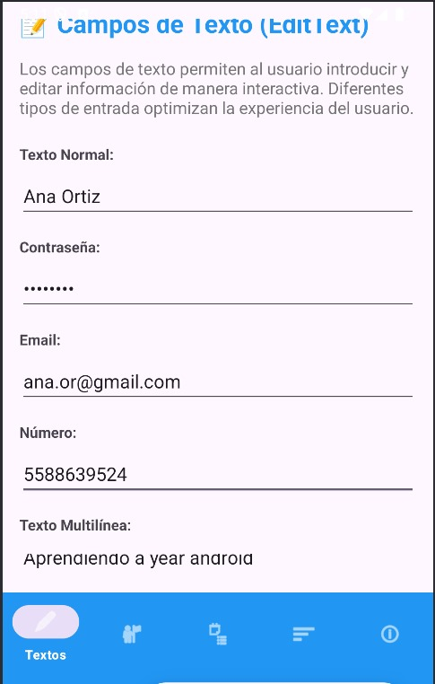
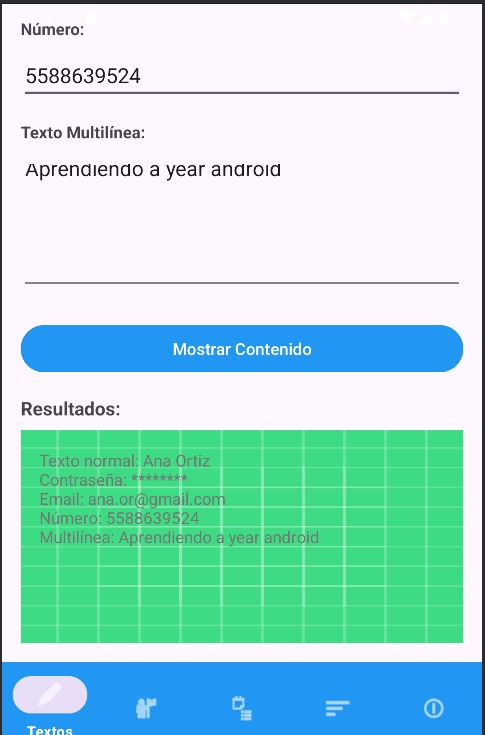
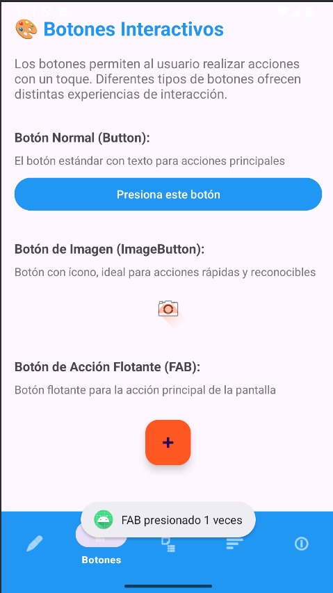
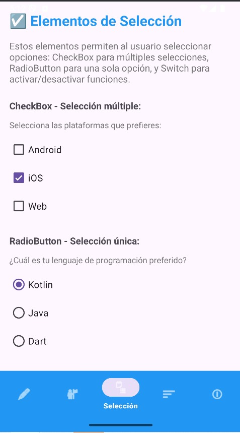
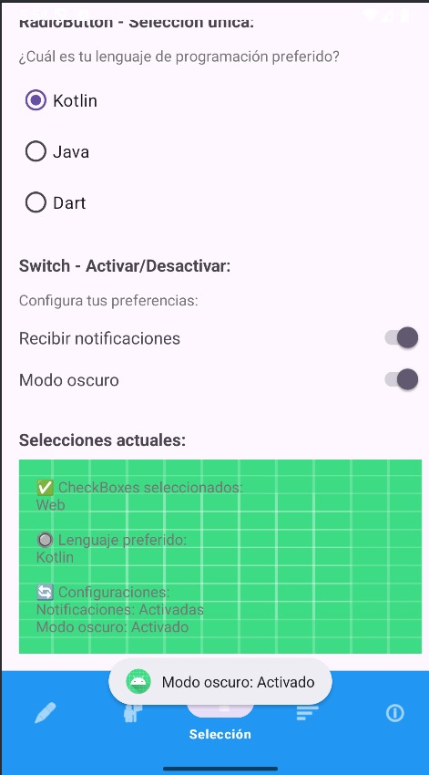
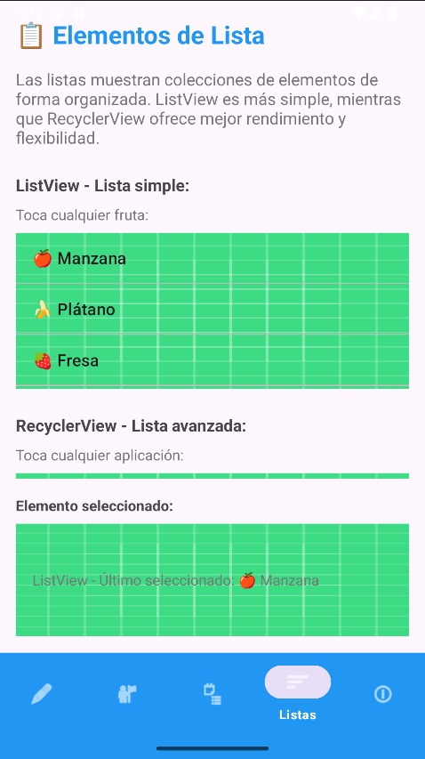
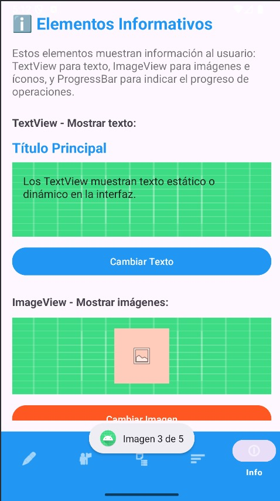

# Tarea 1 - Elementos de Interfaz de Usuario

## Descripción General

Esta primera tarea es una aplicación desarrollada en Android Studio que demuestra el uso de **Activities** y **Fragments** para explicar diferentes elementos de interfaz de usuario (UI).

## 1. Estructura de la App

### Fragment 1: TextFields
- **EditText normal**: Entrada de texto libre
- **EditText password**: Campo de contraseña con texto oculto
- **EditText email**: Optimizado para direcciones de correo
- **EditText number**: Solo permite números
- **EditText multilínea**: Para textos largos

### Fragment 2: Botones
- **Button normal**: Botón estándar con texto
- **ImageButton**: Botón con ícono, ideal para acciones rápidas
- **FloatingActionButton (FAB)**: Botón flotante para acción principal

### Fragment 3: Elementos de selección
- **CheckBox**: Selección múltiple
- **RadioButton**: Selección única
- **Switch**: Activar/desactivar configuraciones

### Fragment 4: Listas (RecyclerView o ListView)
- **ListView**: Lista simple con frutas
- **RecyclerView**: Lista avanzada con aplicaciones

### Fragment 5: Elementos de información
- **TextView**: Textos que cambian dinámicamente
- **ImageView**: Imágenes que rotan entre diferentes recursos
- **ProgressBar**: Barras de progreso horizontal y circular

## 2. Instrucciones de uso

### Requisitos previos
- Android Studio

### Pasos de instalación
1. **Clonar el repositorio**: 
   ```
   https://github.com/Ana-gon03/Tarea01_moviles.git
   ```
2. **Abrir Android Studio**
3. **Navegar hasta la carpeta del proyecto** y seleccionarla
4. Android Studio **descargará automáticamente las dependencias**
5. **Espera a que termine la sincronización de Gradle**

### Ejecutar la aplicación
1. Conecta un **dispositivo Android** o inicia un **emulador**
2. Haz clic en el botón **"Run"**

## ¿Cómo usar la App?

### Navegación
- Se usa la **barra de navegación inferior** para cambiar entre los diferentes fragments
- Cada ícono representa un tipo de elemento UI diferente

### Interacción

#### 1. Fragment de Textos
Completa los diferentes campos y presiona **"Mostrar Contenido"**






#### 2. Fragment de Botones
Toca cada tipo de botón para ver sus efectos




#### 3. Fragment de Selección
Marca/desmarca opciones y observa los cambios en tiempo real






#### 4. Fragment de Listas
Toca elementos en ambas listas para ver la diferencia




#### 5. Fragment de Información
Usa los botones para cambiar contenido y simular progreso



---

## Video
[▶️ Ver video de demostración](app/screenshots/video_app_ko.mp4)
